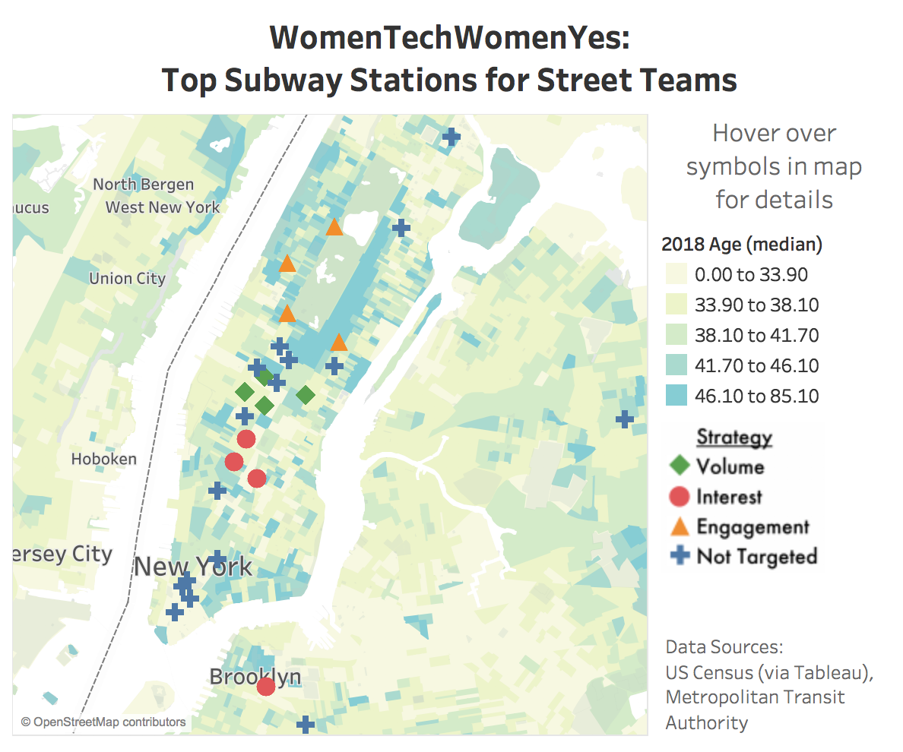

# WomenTechWomenYes (WTWY)
## Project: Super Street Teams
## Kelly Jones, Jonathan Sterling, and Prakash Verma - April 2018
## WTWY Objectives
Maximize WTWY street team efficacy by using publicly available data to optimize team placement at NYC subway entries and exits.

## Recommendations  
Based on the data published by New York City's Metropolitan Transportation Authority (MTA), KPJ Consulting recommends that WTWY street teams are place at a dozen stations grouped by three strategies:
#### 1. VOLUME: Target high-traffic locations

- 34th St - Penn Station
- Grand Central - 42nd St
- 34th St - Herald Square
- Times Square - 42nd St

The first strategy takes advantage of sheer numbers. These stations are centrally located transit hubs and among the highest-trafficked stations in New York City. Street teams will encounter a wide range of both New Yorkers and visitors, contributing to WTWY's goal of increasing awareness and possibly yielding connections with local residents.

#### 2. INTEREST: Target tech hubs

- 23rd St
- 14th St - Union Square
- 14th St
- Jay St - MetroTech

People who work in tech may find the work of WTWY particularly relevant and inspiring. By canvassing outside subway stations in the tech hubs in Manhattan and Brooklyn, especially at lunchtime or during commuting hours, we are more likely to come into contact with interested individuals.

#### 3. ENGAGEMENT: Target residential areas

- 86th St
- 59th St - Columbus Circle
- 59th St
- 72nd St

The nonprofit sector runs on the passion and commitment of people who can contribute their time and resources. Our engagement strategy would place street teams at busy stations in residential areas with higher median age and income, where starting by gathering an email address might turn into a donation, attendance at the gala, or another form of deeper engagement with the organization.

## Other Stations to Consider

An interactive [Tableau dashboard](https://public.tableau.com/profile/kelly.jones4370#!/vizhome/shared/QP3FR7JB2) is available with the data for all 30 stations, including the 12 we recommendeded. WTWY may find that other stations on the map are also suited to their needs.

## Future Direction  
  
We would like to further the work already done by deepening our analysis in a few key ways:
- **Hourly analysis:** Recommendations based on station traffic by time of day
- **Neighborhood Data:** Consider tourism, demographics, charitable giving
- **Evaluation:** Track WTWY results by station, including weather data

