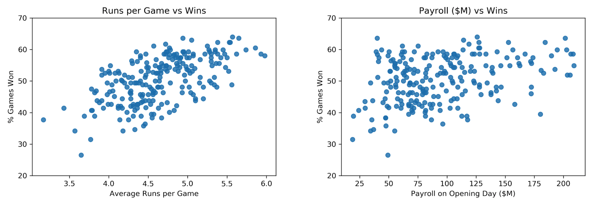

*Note from Kelly: This was an early project and is not reflective of the depth or breadth of my current skillset.*

# Explaining the Mariners' 16-Year Playoff Drought

#### Project: Linear Regression and Web Scraping

#### Kelly Jones - April 2018

## Objective

Use linear regression to investigate and explain the Mariners' 16-year playoff drought, which is the longest active playoff drought of all major American sports. 

***Fun fact:** The Mariners broke the all-time record for number of wins in a season with 116 wins in 2001 but have not made it to the postseason since then.*

## Data Source

Scraped from baseball-reference.com and USA Today. Covered all American League teams in Major League Baseball from 2002 to 2017. Included team's record and key hitting, batting, and fielding statistics, plus payroll and manager tenure.

## Model: Linear Regression

**Target: percent of games won** by the team that year, a continuous measure. Tested polynomials (degrees 2 and 3) but model performed better at degree 1. Trained model on 70% of dataset and tested it on the remaining 30%. For regularization, did elastic net cross-validation weighted toward Ridge regularization. Many features reduced to zero and mostly batting statistics were left.

**Feature Considerations:** It's easy to make a clear but useless model. For example, using only two features--average runs scored and average runs given up--can yield an R-squared value of 0.86, meaning the model explains 86% of the variation in the percent of games won. This is a useless model because its implicit suggestion for winning games is just to play well! More useful models, like the final model for this project, dropped obvious variables and used only those specific, actionable features (ex: singles or doubles rather than hits or runs) where a team might be able to make a change.

**Illustration: What's more useful?**  
*Tight correlation between **runs** and wins (left). Looser correlation between **payroll** and wins (right). Opted to use features like payroll in model because they are more within an organization's control.*

## Findings

Features that emerged as small but statistically significant included:
* Singles 
* Homeruns
* Walks
* Hit by pitch
* Intentional walks
* Caught stealing (negative)
* Left on base (negative)

No relationship found with manager tenure, payroll, or the "Mariners curse" (dummy variable by team - 1 for Mariners, 0 for everyone else).

## Bottom Line

There's no one reason why the Mariners have not made it to the playoffs, and hence no key lever to pull. It's a lot of little things. There was no evidence of a "Mariners curse."

## Future Direction

This model could be extended by adding in richer data features to help round out the picture of what has happened since 2002. These data are available but were not included in the original analysis because they are either behind a paywall or are difficult to scrape.

- **Injury Data:** Who's been injured and for how long; how many $M are sitting on the bench
- **Top Players:** How many award-winning players, and in which positions
- **Leadership:** Changes in top-level leadership, i.e., owners and general managers
- **Rising Talent:** Strength of the farm system; performance of their AAA team
