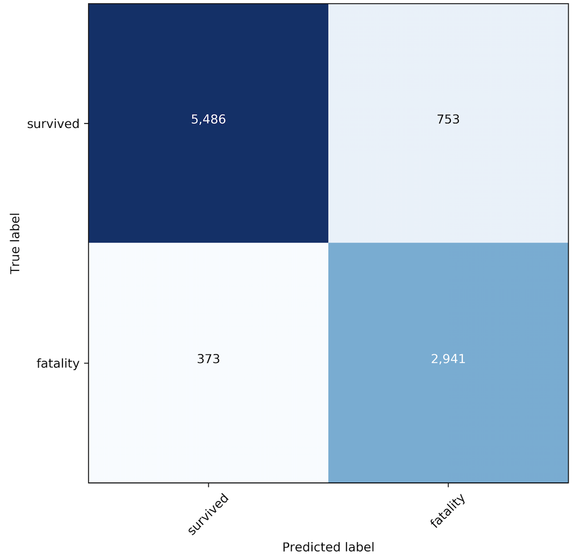
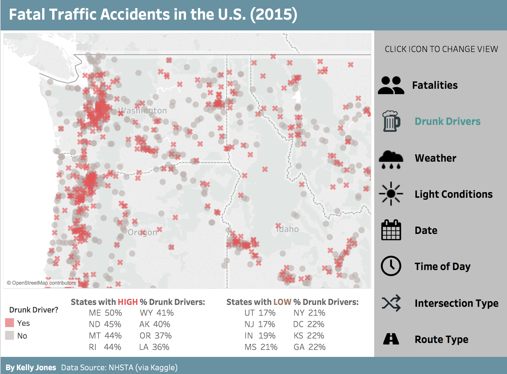

# Safety First: Classifying Traffic Fatalities

#### Project: Supervised Learning, Classification, Interactive Visualization

#### Kelly Jones - May 2018

## Objective

1. Use classification models and supervised machine learning to derive fatality predictions for each individual based on factors of motor vehicle accidents
2. Create interactive visualizations of the underlying data to extend viewer understanding of the problem

## Data Source

National Highway Traffic Safety Administration (NHTSA) national records of every fatal motor vehicle accident in 2015. This analysis included drivers and passengers in motor vehicles, not other involved persons such as pedestrians, bicyclists, or road workers. Data included information at three nested levels:
* **Person:** Individual details such as age, and seatbelt use for every driver and passenger.
* **Vehicle:** Each person was in a vehicle. Vehicle details included make and model, year, whether it rolled over, and whether that driver was drunk.
* **Accident:** Each accident involved one or more vehicles. Accident details included location, weather, road type, and the total number of drunk drivers involved in the accident.

After removing nulls, the datatset had 48,000 observations (people), more than 20,000 of whom sustained fatal injuries.

## Model: Random Forest (Decision Trees)

**Models Considered:** 
* Decision Trees/Random Forest
* K Nearest Neighbors
* Logistic Regression
* Linear SVC

**Winner: CatBoost (Gradient-Boosted Decision Trees)**  
Decision trees are especially well-suited to this dataset, as it is rich with categorical variables which are difficult to handle in most other classification models. All the data was initially numeric, which required decoding via a 600-page codebook. (Example: each state had its own number on a numeric scale.) Any of the above models would technically run on the dataset when it was numeric, but the output was meaningless. If Alabama is 1 and Wyoming is 50, the model will look for a sequential relationship among states even if none exists. As we know, Wyoming is not 50 times as "state" as Alabama. Decision trees are great at handling categorical data without requiring a feature with 50 options to be turned into 50 dummy variables.

The standard Python implementations of decision trees and Random Forest via `scikitlearn` are not set up for categorical variables, even though decision trees are inherently suited for that. The `CatBoost` package (short for "category boost") fills this gap by accepting string features as valid inputs for a decision tree and adds power to the model with gradient boosting.

## Model Performance

After training on 70% of the data, the model had an 89% accuracy rate in predicting survival vs. fatality for the remaining 30% of test cases. It correctly classified 2,941 fatalities and 5,486 survivors. However, it expected 753 fatalities among people who actually survived (false positives) and, most troublingly, expected 373 people to survive who were actually fatalities (false negatives). Remember that fatality was the "positive" condition because we sought to predict it with our model, not because it is good. The confusion matrix below represents these proportions.

The rate of "recall" which tries to minimize false negatives was 90%. This is good, but not good enough. A false negative means that our model cannot explain why someone was a fatality, and thus we cannot act on information to change that outcome for future motorists. 

## Visualizing Results

**Tableau Dashboard**
Such a rich dataset with such social relevance deserves visualization. In the accompanying [Tableau dashboards](https://public.tableau.com/profile/kelly.jones4370#!/vizhome/TrafficFatalities2015_0/Fatalities), which are interactive and publicly available, viewers can use a map to explore the data they are most interested in and find differences by time of day, day of week, weather, drunk driving, and more. Perhaps the most startling finding was that so many fatal accidents involved at least one drunk driver.

**Flask App**
* In addition, a locally-hosted Flask app enables real-time predictions of fatality based on different numeric inputs. This app ran on a different model, logistic regression, and incorporated only numeric data. It was not as robust as the decision tree model but did predict fatalities with over 75% accuracy. Viewers can access a demo video for the flask app in this repository.

## Future Direction

This project could be extended and improved in a few key ways:

- **Improve Recall:** Adjust model (e.g., thresholds) to reduce false negatives
- **Decode Sequence of Events:** Update dashboards with details of how events unfolded
- **Analysis by State:** Normalized to state population for sake of comparability
